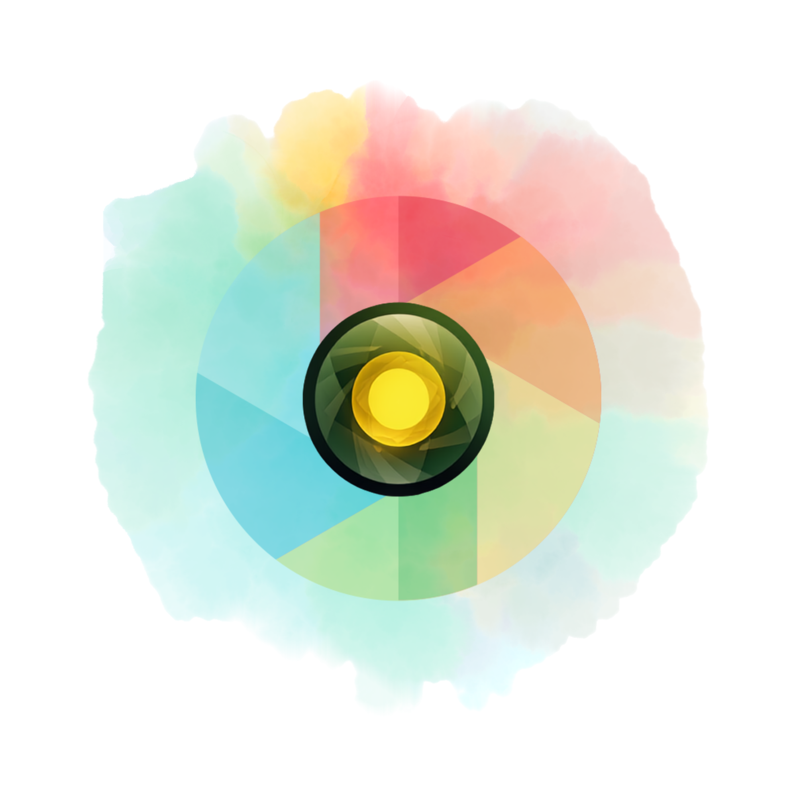

# Sylva

<p align="center">
  
</p>

Sylva is a beautiful, offline-first camera application designed to help you capture, extract, and discover the world's colors effortlessly. Using an advanced color quantization algorithm locally on your device, it analyzes live camera data or photos to generate harmonious color palettes in real-time.

## Features

- **Instant Color Extraction**: Take a photo or select an image to instantly analyze and extract a beautiful, dynamic color palette.
- **Offline & Private**: All processing happens locally on your device. No data or images are ever uploaded to the cloud.
- **Image Import**: Extract palettes from photos saved in your gallery.
- **Customizable Export**: Choose between various shapes, layouts, fonts (via Google Fonts), and text styles (HEX, RGBA) to export your palette overlay onto your images.
- **Save & Share**: Quickly save the result to your photo library or share it on social media.
- **Multi-language Support**: Fully localized in English, Vietnamese, Japanese, and Chinese.

## Supported Platforms

- **Android**: Supported on Android 5.0 (Lollipop, API Level 21) and newer.
- **iOS**: Supported on iOS 12.0 and newer (depending on camera plugin requirements).

## Comparison with other methods

| Feature | Sylva | Online Color Pickers | Standard Camera App + Eyeballing |
| :--- | :--- | :--- | :--- |
| **Speed** | Instant | Slower, requires uploading | Fast, but inaccurate |
| **Privacy** | 100% Local, secure | Cloud-dependent, privacy risks | Local, secure |
| **Palette Generation** | Automatic, harmonious | Manual or basic | Manual, tedious |
| **Export Options** | Customizable overlays | Basic export (usually just text) | None |

## Architecture & Tech Stack

- **Framework**: [Flutter](https://flutter.dev/)
- **State Management**: [flutter_bloc](https://pub.dev/packages/flutter_bloc) (Cubit)
- **Navigation**: [go_router](https://pub.dev/packages/go_router)
- **Localization**: [intl](https://pub.dev/packages/intl)
- **Camera**: [camera](https://pub.dev/packages/camera)

## Getting Started

### Prerequisites
- Flutter SDK (latest stable version)
- Dart SDK
- Android Studio / Xcode for deploying to devices

### Installation

1. Clone the repository:
   ```bash
   git clone <repository_url>
   ```

2. Navigate into the project directory:
   ```bash
   cd sylva
   ```

3. Install dependencies:
   ```bash
   flutter pub get
   ```

4. Generate localization files (if needed):
   ```bash
   dart run intl_utils:generate
   ```

5. Run the application:
   ```bash
   flutter run
   ```

## Acknowledgements

Sylva utilizes some free assets from talented creators on Flaticon and Magnific. Credits are provided inside the app's Settings -> Acknowledgements page.
